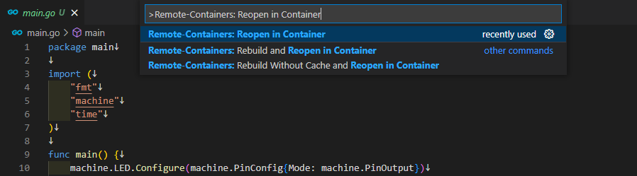
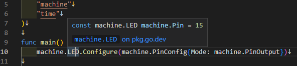

# tinygo-devcontainer

This is an example of setting up TinyGo via VSCode's devcontainer.

## How to use (with VSCode)

First docker pull tinygo/tinygo-dev as it is used internally.

```
$ docker pull tinygo/tinygo-dev
```

Install [Visual Studio Code Remote - Containers](https://marketplace.visualstudio.com/items?itemName=ms-vscode-remote.remote-containers).

Enable remote container with `Remote-Containers: Reopen in Container`



## Internals

The following are used internally

* https://golang.org/x/tools/gopls
* https://golang.org/x/tools/cmd/goimports
* https://marketplace.visualstudio.com/items?itemName=tinygo.vscode-tinygo
    * `TinyGo target` to enable LSP  
    
* https://github.com/sago35/tinygo-autocmpl
    * You can use tinygo's bash completion

The configuration file can be found at

* [./.devcontainer](./.devcontainer)

## LICENSE

MIT

## Author

sago35 - <sago35@gmail.com>
